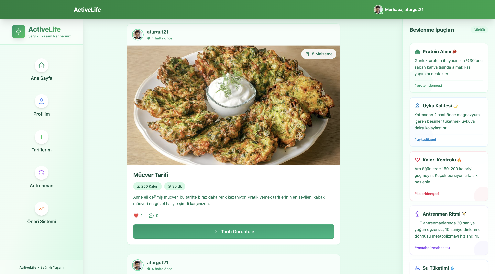
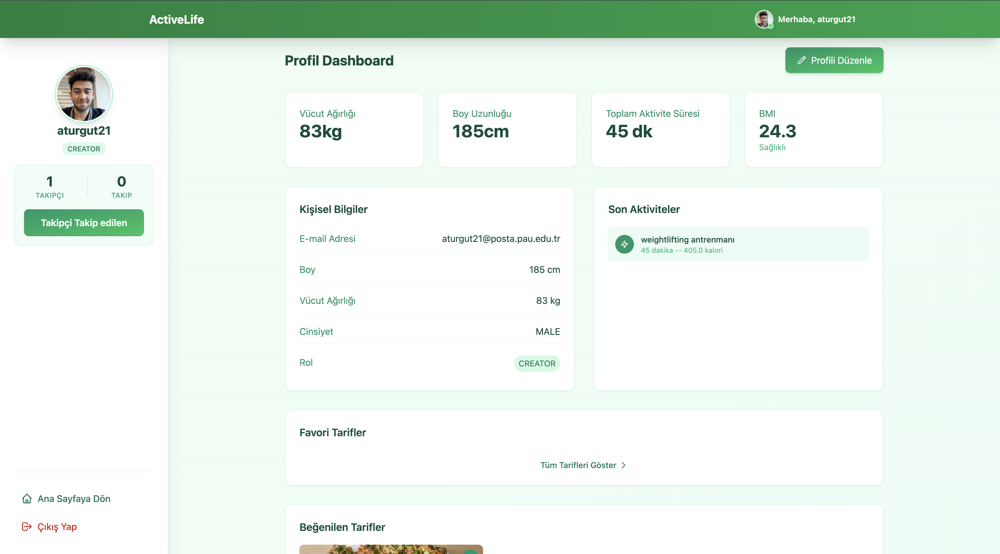
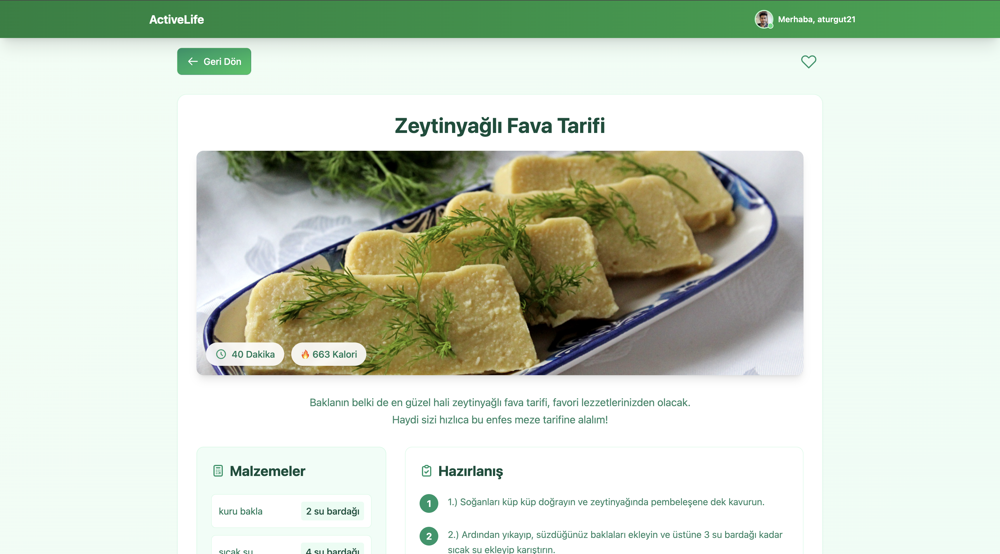
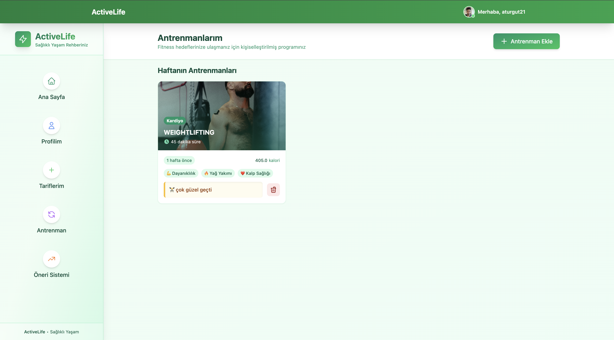

# 🧠 Sağlık ve Fitness Platformu

Kapsamlı bir **dijital sağlık, fitness ve beslenme** platformu. Kullanıcıların bireysel sağlık bilgilerine göre özel öneriler alabileceği, yemek tariflerini keşfedip paylaşabileceği, fiziksel aktivite ve vücut analizlerini takip edebileceği sosyal bir ortam sunar.

## 🚀 Proje Özeti

Bu platform;

- 🥗 **Yemek tarifleri** paylaşımı ve öneri sistemi,
- 🧘 **Aktivite takibi** (örneğin egzersiz süresi, adım sayısı),
- 📊 **Kişisel sağlık analizi** (BMI, kalorimetre vb.),
- 🧑‍🤝‍🧑 **Sosyal medya benzeri etkileşim** (yorum, beğeni, takip),
- 🤖 **Python + BERT tabanlı öneri sistemi** ile kullanıcıya özel tarif önerileri sunar.

## 📚 Teknolojiler

### 🎯 Frontend
- **Angular** 17+
- Tailwind CSS
- RxJS & Angular Forms
- JWT Authentication (token bazlı)

### 🛠️ Backend
- **Spring Boot** (Java)
  - RESTful API
  - JWT Security
  - MySQL / PostgreSQL
  - Redis (opsiyonel cache)
  - Dockerized yapı

### 🧠 Yapay Zekâ / Öneri Sistemi
- **Python + Flask API**
- BERT tabanlı cümle embedding
- Tarif benzerliği üzerinden öneri sistemi
- Kullanıcının favorileri ve geçmişine göre kişiselleştirme

## 🧪 Özellikler

| Özellik | Açıklama |
|--------|----------|
| 👤 Kullanıcı Profili | Kayıt, giriş, profil bilgileri, takip sistemi |
| 🍽️ Tarif Paylaşımı | Başlık, içerik, fotoğraf, kategori, malzeme bilgileri |
| 📈 Analizler | Kullanıcının boy, kilo verisine göre BMI hesabı |
| 💬 Sosyal Etkileşim | Beğeni, yorum, takip ve bildirim sistemi |
| 🧬 Öneri Sistemi | Favorilere göre benzer tarifler önerilir (Python Flask) |
| 🗂️ Admin Paneli | Rol bazlı yetkilendirme ve içerik kontrolü |

## 📸 Ekran Görüntüleri (Opsiyonel)

## ⚙️ Kurulum

### Backend (Spring Boot)

>cd server
./mvnw clean install
java -jar target/fitness-platform.jar

### Frontend (Angular)

>cd client
npm install
ng serve --open

### Öneri Servisi (Python Flask)

>cd recommendation-service
pip install -r requirements.txt
python app.py

## 🧪 API Dökümantasyonu

Swagger UI ile tüm API'ler test edilebilir:

http://localhost:8080/swagger-ui/index.html

## 🔐 Güvenlik

- Spring Security + JWT
- Role-based erişim kontrolü (USER / ADMIN)
- Giriş / kayıt endpoint’leri public, diğerleri auth gerektiriyor
